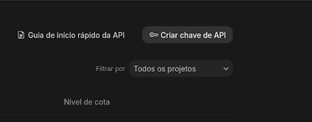
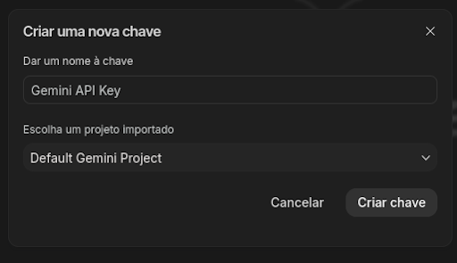
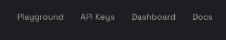
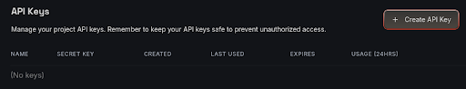
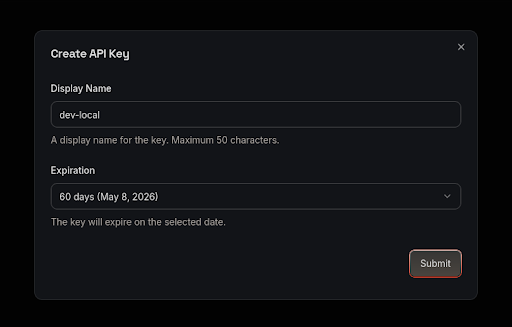

# O que é uma chave de API de um LLM?

Uma **chave de API (API Key)** é um identificador exclusivo usado para **autenticar e autorizar** o acesso a um serviço de inteligência artificial hospedado na nuvem, como os modelos da OpenAI, Google ou Anthropic.

> **Nota:** Esses modelos são chamados de **LLMs (Large Language Models)** e rodam em servidores de alta capacidade dessas empresas.

Quando um programa quer utilizar um modelo como **Gemini** ou **Llama**, ele precisa enviar uma requisição para a API do provedor. A API Key funciona como uma credencial, semelhante a uma senha, que informa ao servidor:

- **Quem** está fazendo a requisição;
- **Qual projeto** está usando o serviço;
- **Quais limites e permissões** se aplicam;
- **Como contabilizar** o uso (rate limit, billing, etc.).

> **Aviso:** Sem essa chave, o serviço simplesmente **não permite o acesso ao modelo**.

## Como a chave de API funciona na prática?

Quando um programa envia uma solicitação para um LLM, ele inclui a chave no **cabeçalho da requisição HTTP**.

**Exemplo simplificado:**

```http
POST /v1/chat/completions
Authorization: Bearer SUA_API_KEY
Content-Type: application/json
```

O servidor então realiza os seguintes passos:

1. Valida a chave.
2. Identifica o usuário ou projeto.
3. Verifica os limites de uso.
4. Processa a solicitação no modelo.
5. Retorna a resposta do LLM e a devolve.

# Recomendações para o case: API do Gemini ou Groq

## GEMINI

### 1. Acessar o Google AI Studio

Entre no portal [Google AI Studio](https://aistudio.google.com) e faça login com sua **conta Google**.

### 2. Criar a chave

Clique no botão **Create API key**.

<div align="center">
  
</div>

Escolha a opção **Gemini Default Project**.

<div align="center">
  
</div>

Após confirmar, sua **API Key será gerada**.

### 3. Copiar e guardar a chave

A chave terá um formato parecido com este:

```text
AIzaSy**************
```

> **Importante:** Guarde esta chave em um local seguro. Ela será usada para autenticar todas as suas requisições à API.

## GROQ

Caso precise de mais opções, o Groq é uma alternativa interessante. Ele oferece maiores limites gratuitos e uma variedade de modelos de linguagem.

### 1. Criar conta

Acesse o console do Groq: [https://console.groq.com](https://console.groq.com)

Clique em **Sign Up** e crie sua conta usando:

- Google
- GitHub
- Email

### 2. Criar API Key

No menu lateral, clique em **API Keys**:

<div align="center">
  
</div>

Depois, clique no botão **Create API Key**:

<div align="center">
  
</div>

Defina o **nome da chave** e a **data de expiração**:

<div align="center">
  
</div>

Clique em **Submit**. A chave terá um formato parecido com:

```text
gsk_xxxxxxxxxxxxxxxxxxxxx
```

> **Atenção:** Copie e guarde esta chave imediatamente, pois **você não poderá visualizá-la novamente**.
