# Exemplo prático: Fluxo n8n + Gemini

Neste exemplo, criaremos um fluxo de automação onde:

1. Um **Webhook** recebe uma requisição HTTP.
2. A mensagem é enviada para o **Gemini**.
3. O modelo processa a pergunta.
4. A resposta é devolvida ao usuário.

**Arquitetura do fluxo:**

> `Usuário` ➔ `Webhook` ➔ `Gemini` ➔ `Resposta`

## Passo 1 — Criar um workflow

Abra o workspace do **n8n** e crie um **novo workflow**.

<div align="center">
  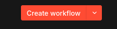
</div>

## Passo 2 — Criar o Webhook

### O que é um Webhook?

Um **Webhook** é um endpoint HTTP que permite que sistemas externos enviem dados para um workflow. Neste caso, ele será responsável por **receber a pergunta enviada pelo usuário**.

**Criando um webhook:**
Clique no botão **`+`** no canto superior da tela:

<div align="center">
  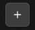
</div>

Na barra que aparecer, pesquise por `webhook` e clique nele:

<div align="center">
  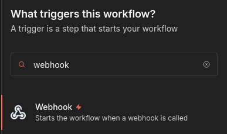
</div>

Ao clicar, será aberta a tela de configuração do webhook.

### Configuração

Adicione o node **Webhook** com os seguintes parâmetros:

- **HTTP Method:** `POST`
- **Path:** `chat`
- **Respond:** `Using Respond to Webhook Node`

> _Essa configuração fará com que o Webhook espere até o final do workflow para retornar a resposta ao usuário._

<div align="center">
  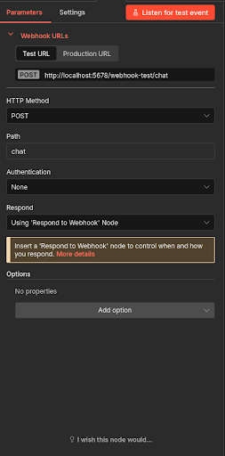
</div>

## Passo 3 — Adicionar node Gemini

Após configurar o Webhook, saia da tela de configuração e clique novamente no botão **`+`**.

<div align="center">
  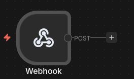
</div>

Isso abrirá a barra lateral. Pesquise por `Gemini` e selecione **Google Gemini**.

<div align="center">
  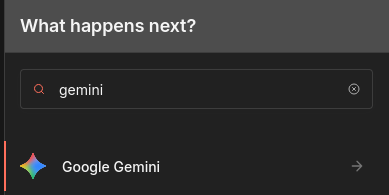
</div>

Depois, selecione a opção **Message a model**. Isso abrirá a tela de configuração do node.

<div align="center">
  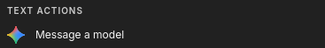
</div>

### Configurar credenciais

Clique em: `Credentials ➔ Create new credential`

<div align="center">
  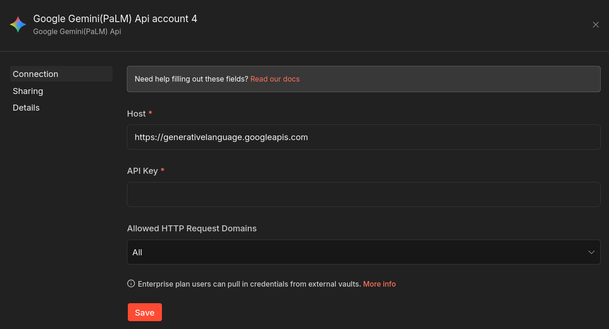
</div>

Insira sua **API Key do Gemini** (aquela que geramos no início do tutorial).

### Configuração do node

- **Resource:** `Text`
- **Model:** `gemini-3-pro-preview`

No campo **Prompt**, use a seguinte expressão:

```text
Responda a seguinte pergunta do usuário de forma clara e objetiva:

{{$json["body"]["message"]}}
```

> _Essa expressão faz com que o node pegue a mensagem enviada no Webhook e a envie para o modelo de linguagem._

<div align="center">
  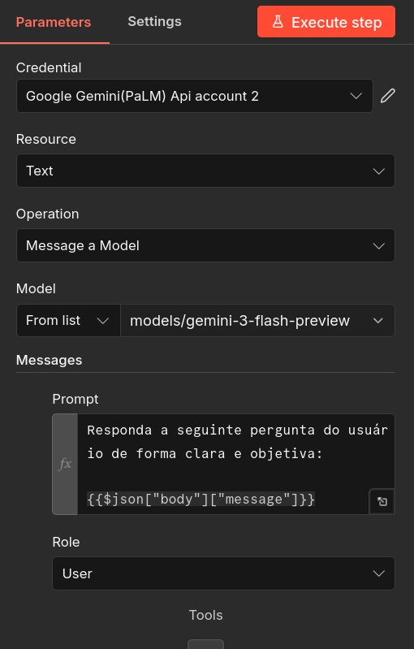
</div>

## Passo 4 — Node de resposta

Depois de configurar o node do Gemini, volte à tela principal e clique novamente no botão **`+`**.

<div align="center">
  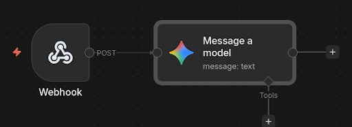
</div>

Na barra de busca, procure por **Respond to Webhook** e selecione o node.

<div align="center">
  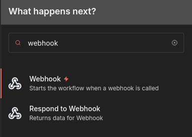
</div>

### Configuração:

- **Respond With:** `JSON`

No **Response Body**, insira:

```json
{
  "response": "{{$json.content.parts[0].text}}"
}
```

> _Essa expressão extrai apenas o texto da resposta gerada pelo modelo, deixando o retorno da API mais simples e direto._

<div align="center">
  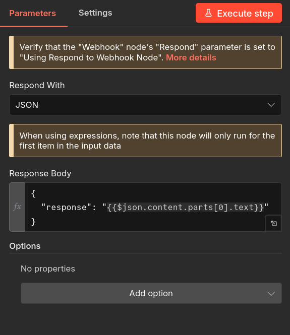
</div>

## Passo 5 — Publicar e executar o workflow

Após finalizar a configuração de todos os nodes, clique em **Publish**.

<div align="center">
  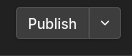
</div>

Em seguida, clique em **Execute Workflow** para deixá-lo aguardando o teste.

<div align="center">
  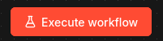
</div>

## Passo 6 — Testar o fluxo

O seu **Webhook** terá gerado um endpoint semelhante a este:

```text
http://localhost:5678/webhook/chat
```

**Exemplo de requisição:**
Abra seu terminal e execute o comando abaixo (ou utilize uma ferramenta como Postman/Insomnia):

```bash
curl -X POST http://localhost:5678/webhook/chat \
 -H "Content-Type: application/json" \
 -d '{"message":"Explique o que é um LLM em uma frase."}'
```

**Fluxo da requisição em ação:**

1. O **Webhook** recebe a pergunta enviada.
2. A mensagem é encaminhada para o **Gemini**.
3. O modelo processa e gera uma resposta inteligente.
4. O **Respond to Webhook** devolve o resultado para você!

<div align="center">
  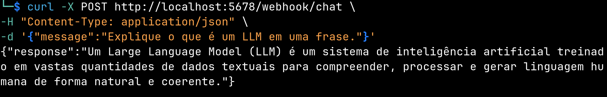
</div>
