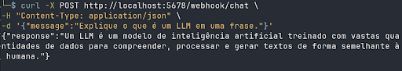

# O que é uma chave de API de um LLM?

Uma **chave de API (API Key)** é um identificador exclusivo usado para **autenticar e autorizar** o acesso a um serviço de inteligência artificial hospedado na nuvem, como os modelos da OpenAI, Google ou Anthropic.

> **Nota:** Esses modelos são chamados de **LLMs (Large Language Models)** e rodam em servidores de alta capacidade dessas empresas.

Quando um programa quer utilizar um modelo como **Gemini** ou **Llama**, ele precisa enviar uma requisição para a API do provedor. A API Key funciona como uma credencial, semelhante a uma senha, que informa ao servidor:

- **Quem** está fazendo a requisição;
- **Qual projeto** está usando o serviço;
- **Quais limites e permissões** se aplicam;
- **Como contabilizar** o uso (rate limit, billing, etc.).

> **Aviso:** Sem essa chave, o serviço simplesmente **não permite o acesso ao modelo**.

---

## Como a chave de API funciona na prática?

Quando um programa envia uma solicitação para um LLM, ele inclui a chave no **cabeçalho da requisição HTTP**.

**Exemplo simplificado:**
```http
POST /v1/chat/completions
Authorization: Bearer SUA_API_KEY
Content-Type: application/json
```

O servidor então realiza os seguintes passos:
1. Valida a chave.
2. Identifica o usuário ou projeto.
3. Verifica os limites de uso.
4. Processa a solicitação no modelo.
5. Retorna a resposta do LLM e a devolve.

---

# Recomendações para o case: API do Gemini ou Groq

## GEMINI

### 1. Acessar o Google AI Studio
Entre no portal [Google AI Studio](https://aistudio.google.com) e faça login com sua **conta Google**.

### 2. Criar a chave
Clique no botão **Create API key**.

<div align="center">
  
</div>

Escolha a opção **Gemini Default Project**.

<div align="center">
  
</div>

Após confirmar, sua **API Key será gerada**.

### 3. Copiar e guardar a chave
A chave terá um formato parecido com este:
```text
AIzaSy**************
```

> **Importante:** Guarde esta chave em um local seguro. Ela será usada para autenticar todas as suas requisições à API.

---

## GROQ

### 1. Criar conta
Acesse o console do Groq: [https://console.groq.com](https://console.groq.com)

Clique em **Sign Up** e crie sua conta usando:
- Google
- GitHub
- Email

### 2. Criar API Key
No menu lateral, clique em **API Keys**:

<div align="center">
  
</div>

Depois, clique no botão **Create API Key**:

<div align="center">
  
</div>

Defina o **nome da chave** e a **data de expiração**:

<div align="center">
  
</div>

Clique em **Submit**. A chave terá um formato parecido com:
```text
gsk_xxxxxxxxxxxxxxxxxxxxx
```

> **Atenção:** Copie e guarde esta chave imediatamente, pois **você não poderá visualizá-la novamente**.

---

# Exemplo prático: Fluxo n8n + Gemini

Neste exemplo, criaremos um fluxo de automação onde:
1. Um **Webhook** recebe uma requisição HTTP.
2. A mensagem é enviada para o **Gemini**.
3. O modelo processa a pergunta.
4. A resposta é devolvida ao usuário.

**Arquitetura do fluxo:**
> `Usuário` ➔ `Webhook` ➔ `Gemini` ➔ `Resposta`

---

## Passo 1 — Criar um workflow
Abra o workspace do **n8n** e crie um **novo workflow**.

<div align="center">
  
</div>

---

## Passo 2 — Criar o Webhook

### O que é um Webhook?
Um **Webhook** é um endpoint HTTP que permite que sistemas externos enviem dados para um workflow. Neste caso, ele será responsável por **receber a pergunta enviada pelo usuário**.

**Criando um webhook:**
Clique no botão **`+`** no canto superior da tela:

<div align="center">
  
</div>

Na barra que aparecer, pesquise por `webhook` e clique nele:

<div align="center">
  
</div>

Ao clicar, será aberta a tela de configuração do webhook.

### Configuração
Adicione o node **Webhook** com os seguintes parâmetros:
- **HTTP Method:** `POST`
- **Path:** `chat`
- **Respond:** `Using Respond to Webhook Node`

> *Essa configuração fará com que o Webhook espere até o final do workflow para retornar a resposta ao usuário.*

<div align="center">
  
</div>

---

## Passo 3 — Adicionar node Gemini
Após configurar o Webhook, saia da tela de configuração e clique novamente no botão **`+`**.

<div align="center">
  
</div>

Isso abrirá a barra lateral. Pesquise por `Gemini` e selecione **Google Gemini**.

<div align="center">
  
</div>

Depois, selecione a opção **Message a model**. Isso abrirá a tela de configuração do node.

<div align="center">
  
</div>

### Configurar credenciais
Clique em: `Credentials ➔ Create new credential`

<div align="center">
  
</div>

Insira sua **API Key do Gemini** (aquela que geramos no início do tutorial).

### Configuração do node
- **Resource:** `Text`
- **Model:** `gemini-3-pro-preview`

No campo **Prompt**, use a seguinte expressão:
```text
Responda a seguinte pergunta do usuário de forma clara e objetiva:

{{$json["body"]["message"]}}
```

> *Essa expressão faz com que o node pegue a mensagem enviada no Webhook e a envie para o modelo de linguagem.*

<div align="center">
  
</div>

---

## Passo 4 — Node de resposta
Depois de configurar o node do Gemini, volte à tela principal e clique novamente no botão **`+`**.

<div align="center">
  
</div>

Na barra de busca, procure por **Respond to Webhook** e selecione o node.

<div align="center">
  
</div>

### Configuração:
- **Respond With:** `JSON`

No **Response Body**, insira:
```json
{
  "response": "{{$json.content.parts[0].text}}"
}
```

> *Essa expressão extrai apenas o texto da resposta gerada pelo modelo, deixando o retorno da API mais simples e direto.*

<div align="center">
  
</div>

---

## Passo 5 — Publicar e executar o workflow

Após finalizar a configuração de todos os nodes, clique em **Publish**.

<div align="center">
  
</div>

Em seguida, clique em **Execute Workflow** para deixá-lo aguardando o teste.

<div align="center">
  
</div>

---

## Passo 6 — Testar o fluxo

O seu **Webhook** terá gerado um endpoint semelhante a este:
```text
http://localhost:5678/webhook/chat
```

**Exemplo de requisição:**
Abra seu terminal e execute o comando abaixo (ou utilize uma ferramenta como Postman/Insomnia):
```bash
curl -X POST http://localhost:5678/webhook/chat \
 -H "Content-Type: application/json" \
 -d '{"message":"Explique o que é um LLM em uma frase."}'
```

**Fluxo da requisição em ação:**
1. O **Webhook** recebe a pergunta enviada.
2. A mensagem é encaminhada para o **Gemini**.
3. O modelo processa e gera uma resposta inteligente.
4. O **Respond to Webhook** devolve o resultado para você!

<div align="center">
  
</div>
